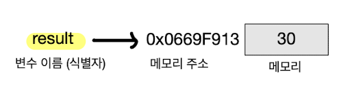

# 📚 변수(Variable)
## 📝 변수(Variable)
`변수(Variable)`란   
1. 하나의 값을 저장하기 위해 확보한 `메모리 공간 자체` 또는 그 메모리 공간을 `식별하기 위해 붙인 이름`
2. `값의 위치`를 가리키는 상직적인 이름

<br/>

❇︎ <b>변수 이름(변수명)</b> : 메모리 공간에 저장된 값을 식별할 수 있는 고유한 이름   
❇︎ <b>변수 값</b> : 변수에 저장된 값   
❇︎ <b>할당(대입,저장/assignment)</b> : 변수에 값을 저장하는 것   
❇︎ <b>참조(reference)</b> : 변수에 저장된 값을 읽어 들이는 것   

```javascript
// 예제 : 10 + 20의 연산결과 30을 result라는 변수에 저장한 것
var result = 10 + 20;
```

<br/>

### 💡 변수에 여러 개의 값을 저장하는 방법
변수는 `하나의 값을 저장`하기 위한 메커니즘   
여러 개의 값을 저장하려면 여러 개의 변수를 사용해야 한다.  
단, 배열이나 객체같은 자료구조 사용하면 여러 개의 값을 그룹하해서 하나의 값처럼 사용 가능


```javascript
// 변수는 하나의 값을 저장하기 위한 수단
var userId = 1;
var userName = "Lee";

// 객체나 배열 같은 자료구조를 사용하면 여러 개의 값을 하나로 그룹화해서 하나의 값처럼 사용할 수 있음
var user = { id: 1, name: 'Lee' };

var users = [
    { id: 1, name: 'Lee'},
    { id: 2, name: 'Kim'}
];
```


## 📝 식별자(Identifier)
`식별자(Identifier)` 는 어떤 값을 구별해서 식별할 수 있는 고유한 이름을 말한다.



- 식별자 result는 값 30을 식별할 수 있다.
- 이를 위해 result는 값 30이 저장되어 있는`메모리 주소(0x0669F913)를 기억`한다.
- 즉, 식별자는 값이 `저장되어 있는 메모리 주소와 매핑 관계`를 맺으며, 매핑 정보도 메모리에 저장되어야 한다.

<br/>

> 식별자는 값이 아니라 `메모리 주소를 기억`하고 있다.   
>식별자로 값을 구별해서 식별한다는 것 = 식별자가 기억하고 있는 메모리 주소를 통해 메모리 공간에 저장된 값에 접근할 수 있다는 의미    
>즉, 식별자는 `메모리 주소에 붙인 이름`이라고 할 수 있음   

<br/>

- 변수, 함수, 클래스 등의 이름은 모두 식별자
    - 변수 이름 -> 메모리 상에 존재하는 변수 값 식별
    - 함수 이름 -> 메모리 상에 존재하는 함수를 식별
- 즉, 메모리 상에 존재하는 어떤 값을 식별할 수 있는 이름은 모두 식별자


<br/>

## 📝 변수 선언(Variable Declaration)
`변수 선언(Variable Declaration)`은 변수를 생성하는 것
> 값을 저장하기 위한 메모리 공간을 확보하고 변수 이름과 확보된 메모리 공간의 주소를 연결해서 값을 저장할 수 있게 준비하는 것
- 변수를 사용하려면 반드시 선언이 필요
- 변수 선언시 `var`, `let`, `const` 키워드 사용
- ES6에서 `let, const 키워드` 도입되었음, 이 전까지는 `var 키워드`만 사용했다.

<br/>

```
💡 var 키워드 단점

블록 레벨 스코프(Block-Level Scope)를 지원하지 않고, 함수 레벨 스코프(Functional-Level Scope)를 지원했다.
이로 인해 의도치 않게 `전역 변수가 선언`되어 심각한 부작용이 발생할 수 있다.

이런 var 키워드의 단점을 보완하기위해 등장한 것들이 ES6에 도입된 `let과 const` 다.
이 둘은 `블록 레벨 스코프를 지원`한다.
```
<br/>

```
💡 키워드(Keyword)   

자바스크립트 코드를 해석하고 실행하는 자바스크립트 엔진이 수행할 동작을 규정한 일종의 명령어
```

<br/>

1. 변수 선언문은 `변수 이름을 등록`하고 `값을 저장할 메모리 공간을 확보`한다.
2. 변수 선언한 이후, 변수에 값은 아직 할당하지 않았다.
3. 따라서, 확보된 메모리 공간은 비어있을 것으로 생각할 수 있으나 확보된 메모리 공간에는 자바스크립트 엔진에 의해 `undefined 값이 암묵적으로 할당되어 초기화`된다.

<br/>

```
💡 undefined   

undefined는 자바스크립트에서 제공하는 원시 타입의 값(Primitive value)이다.
```

<br/>

> 변수 선언을 2단계에 거쳐 수행한다.
1. `선언 단계` : 변수 이름을 등록해서 자바스크립트 엔진에 변수의 존재를 알린다.
2. `초기화 단계` : 값을 저장하기 위한 메모리 공간을 확보하고 암묵적으로 undefined를 할당해 초기화한다.

- var let const 키워드를 사용한 변수 선언은 선언단계와 초기화 단계가 동시에 진행 된다.
- 예를 들어 var score;는 선언 단계를 통해 변수 이름 score를 등록한다.
- 초기화 단계를 통해 score 변수에 암묵적으로 undefined를 할당해 초기화한다.
- 따라서, var 키워드로 선언한 변수는 어떠한 값도 할당하지 않아도 기본적으로 undefined 라는 값을 갖는다.   

<br/>

```
 💡 쓰레기 값(Garbage value)

초기화 단계를 거치지 않으면 확보된 메모리 공간에는 이전에 다른 애플리케이션이 사용했던 값이 남아 있을 수 있다.
이러한 값을 "쓰레기 값(Garbage value)" 라고 한다.
자바스크립트에서 var 키워드는 암묵적으로 undefined 값으로 초기화를 수행하기 때문에 이러한 위험으로부터 안전하다.
```

- 선언하지 않은 식별자에 접근하면 `ReferenceError(참조 에러)`가 발생한다.
- 식별자를 통해 값을 참조하려 했지만 자바스크립트 엔진이 등록된 식별자를 찾을 수 없을 때 발생하는 에러

<br/>

## 📝 변수 선언의 실행 시점과 변수 호이스팅
`변수 호이스팅(variable hoisting)`은 변수 선언문이 코드의 선두로 끌어 올려진 것처럼 동작하는 자바스크립트 고유의 특징

```javascript
console.log(score); // undefined

var score; // 변수 선언문
```
- 자바스크립트 코드는 인터프리터에 의해 한 줄씩 순차적으로 실행
1. console.log(score);가 가장먼저 실행
2. var score; 실행
- console.log(score);가 실행되는 시점에는 아직 score 변수의 선언이 실행되지 않았음
    - 참조 에러가 발생할 것 처럼 보임 -> 하지만 undefined가 출력

<br/>

- 자바스크립트 엔진은 소스코드를 한 줄씩 순차적으로 실행하기에 앞서 먼저 `소스코드의 평가 과정`을 거치면서 소스코드를 실행하기 위한 준비를 한다.
- 엔진은 변수 선언을 포함한 모든 선언문(변수 선언문, 함수 선언문 등)을 소스코드에서 찾아내 먼저 실행
- 소스코드의 평가 과정이 끝나면 변수 선언을 포함한 모든 선언문을 제외하고 소스코드를 한 줄씩 순차적 실행
- 즉, `변수 선언이 소스코드의 어디에 있든 상관없이 다른 코드보다 먼저 실행` -> `변수 선언이 어디에 위치하던 상관없이 어디서든 변수를 참조할 수 있다.` ( ReferenceError가 발생하지 않는 이유 )

<br/>

## 📝 값의 할당/재할당 
`값을 할당(assignment)/대입,저장`할 때는 할당 연산자 =를 사용한다.

```
var score; // 변수 선언
score = 80; // 값의 할당

var score = 80; // 변수 선언과 값의 할당
```

```
💡 "변수 선언(선언 단계 & 초기화 단계)"이 소스코드가 한 줄씩 순차적으로 실행되는 시점, 즉 런타임(Runtime)이 아니라 그 이전 단계에서 먼저 실행되기 때문이다.
```

```
console.log(score); // undefined

score = 80; // 값의 할당
var score; // 변수 선언

console.log(score); // 80
```
- 변수 선언 : 런타임 이전에 먼저 실행
- 값의 할당 : 런타임에 실행

<br/>


`값의 재할당`은 이미 값이 할당되어 있는 변수에 새로운 값을 또다시 할당하는 것
```
var score = 80; // 변수 선언과 값의 할당
score = 90; // 값의 재할당
```
- 재할당은 변수에 `저장된 값`을 `다른 값으로 변경`한다.
- 값을 재할당 할 수 없어서 변수에 저장된 값을 `변경할 수 없다`면 변수가 아니라 `상수(constant)`라 한다.
    - 상수는 한 번 정해지면 변하지 않는 값, 한 번만 할당할 수 있는 변수

<br/>

```
💡 const 키워드
const 키워드는 단 한 번만 할당할 수 있는 변수를 선언한다.
const 키워드를 사용하면 상수를 표현 할 수 있다.
```


<br/>

## 📝 식별자 네이밍 규칙
- 식별자는 특수문자를 제외한 문자, 숫자, 언더스코어(_), 달러 기호($)를 포함할 수 있다.
- 단 식별자는 특수문자를 제외한 문자, 언더스코어(_), 달러 기호($)로 시작해야한다.
    - `숫자로 시작하는것은 허용하지 않는다.`
- 예약어는 식별자로 사용할 수 없다.
    - 예 : if, class, const, do, delete, extends 등등

```
// 카멜 케이스(camelCase)
var firstName;

// 스테이크 케이스(snake_case)
var first_name;

// 파스칼 케이스(PascalCase)
var FirstName;

// 헝가리언 케이스(typeHungarianCase)
var strFirstName; // type + identifier
var $elem = document.getElementById('myId'); // DOM 노드
var observable$ = fromEvent(document, 'click'); // RxJS 옵저버블
```

- 변수나 함수의 이름에는 카멜 케이스 사용
- 생성자 함수, 클래스의 이름에는 파스칼 케이스


<br/>